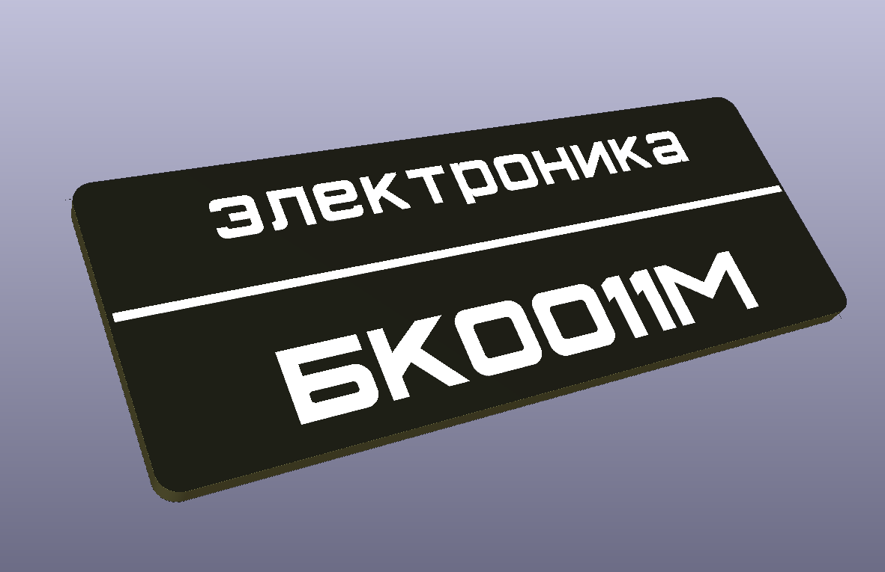

# Шильдики для БК001х

## БК 0011М

__BK_0011M_FRONT-gerbers.zip__ - файлы для изготовления шильдика на печатной плате. Желательно использовать плату толщиной 1.4мм с черной матовой маской, однако на стандартной 1.6мм с глянцевой черной маской получется тоже приемлимо. Слегка увеличен зазор по периметру на случай разницы в размерах посадосных мест на корпусе.

